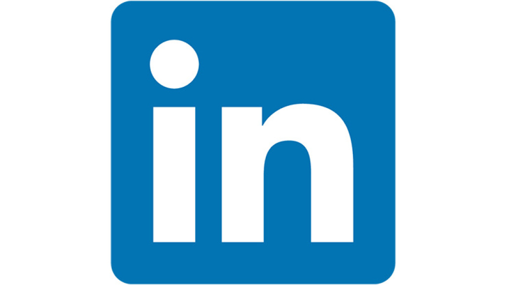

<h1 align="center">   I'm <a href="https://www.linkedin.com/in/danial-monachan-b09494142/">Danial Monachan</a>. Welcome to my GitHub! 🤗</h1>

- I’m currently working on my pathway to **Data Scientist**.  🔭 

- I’m currently learning  🌱  MAchine Learning and Statistics*, NLP and how to **build up my profile's [README.md](https://github.com/Danialmonachan11/My_info/tree/master/README.md)** 💪. 

- I’m looking for help with *Machine Learning & Data Science.* 🤔 

- Ask me about **anything**, **anytime**! 💬 

- Fun fact: 86% of people try to plus in their USB devices upside down. That makes me feel a lot better about getting it wrong every time! ⚡ 

- How to reach me: [LinkedIn](https://www.linkedin.com/in/danial-monachan-b09494142/) or <a href="mailto:danialmonachan234@gmail.com">Email</a>  📫 

- <a href="https://drive.google.com/drive/u/0/folders/12MhyZ3FichAi7E4jSCbDVFpK-eLDQ6d4">My Resume</a>📝 

  

### About Me

I am also working on  **Machine Learnins** along with **NLP** and **Statistics**.

I aim to be an **Data Scientist**. 

<h2>
Connect with me
</h2>

|  |   | 
|:---:|:---:|:---:|

 
 
